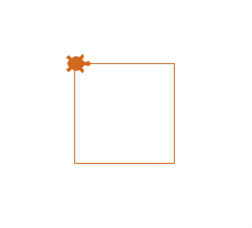
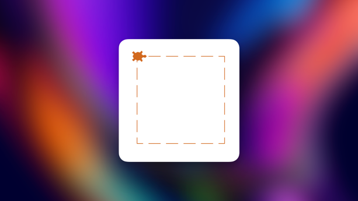
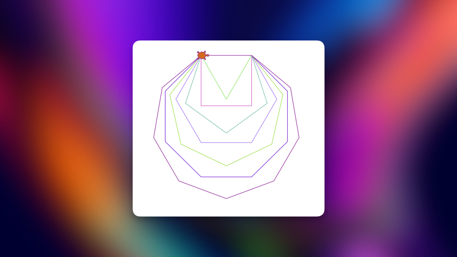

# Day 18 - Turtle Graphics, Tuples and Importing Modules

We used the python module turtle to draw graphics into the screen.

### Reading Documentation:
- Use the documentation of the module to search for functions or variables.
- Use Google to search how to use it
- Use AI

**Tk interface**:
A module to create a GUI.
> GUI - Graphical User Interface


### First Challenge: Draw a square
```python
from turtle import Turtle, Screen

timmy_the_turtle = Turtle()
timmy_the_turtle.shape("turtle")
timmy_the_turtle.color("chocolate")

for step in range(4):
    timmy_the_turtle.forward(100)
    timmy_the_turtle.right(90)


screen = Screen()
screen.exitonclick()
```


### Importing Modules

**Basic Import**:<br>
```python
# Import
import turtle

# Syntax
tim = turtle.Turtle()
```

**from...import...**:<br>
When we use one specific import a lot.
```python
from turtle import Turtle

# Syntax:
tim = Turtle()
```

**from...import (*)**:<br>
Import all the methods and variables
```python
from turtle import *
from random import *

# Syntax
forward(100)
random()
choice()
```

**Aliases modules**:<br>
Give the module a alias name
```python
import turtle as t

# Syntax
tim = t.Turtle()
```

## Python standard library
All the modules that are included in python, like the turtle module.

### Access another modules
We use PyPI to install the modules.

## Challenge 2 - Draw Dashed line
My first attempt:
```python
from turtle import Turtle, Screen

tim = Turtle()
tim.shape("turtle")
tim.color("chocolate")

for _ in range(4):
    for steps in range(10):
        if steps % 2:
            tim.pu()
            tim.forward(10)
        tim.pd()
        tim.forward(10)
    tim.right(90)


screen = Screen()
screen.exitonclick()
```
Simple version:
```python
from turtle import Turtle, Screen

tim = Turtle()
tim.shape("turtle")
tim.color("chocolate")

for _ in range(4):
    for steps in range(10):
        tim.pu()
        tim.forward(10)
        tim.pd()
        tim.forward(10)
    tim.right(90)


screen = Screen()
screen.exitonclick()
```



## Challenge 3:
Solution: Use 360 and divide by the corners.

```python
from turtle import Turtle, Screen
import random

number_of_colors = 100

color = ["#"+''.join([random.choice('0123456789ABCDEF') for j in range(6)])
             for i in range(number_of_colors)]

tim = Turtle()
tim.shape("turtle")
tim.color("chocolate")

for corners in range(3, 10):
    angle = 360 / corners  # 90 degree
    tim.pencolor(random.choice(color)) # Random color
    for sides in range(corners):
        tim.forward(100)
        tim.right(angle)


screen = Screen()
screen.exitonclick()
```



## Final project - The Hirst Painting


