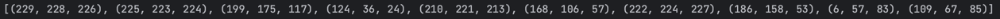
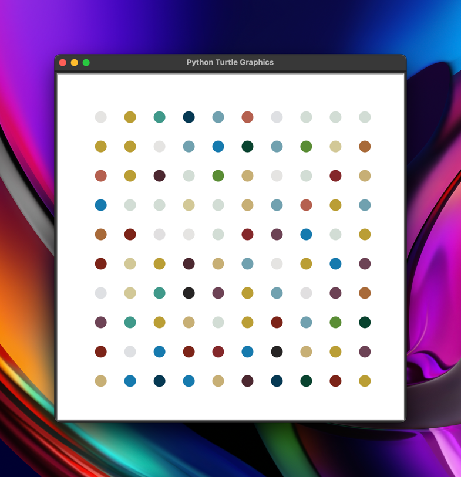

# Day 18 - Turtle Graphics, Tuples and Importing Modules

We used the python module turtle to draw graphics into the screen.

### Reading Documentation:
- Use the documentation of the module to search for functions or variables.
- Use Google to search how to use it
- Use AI

**Tk interface**:
A module to create a GUI.
> GUI - Graphical User Interface


### First Challenge: Draw a square
```python
from turtle import Turtle, Screen

timmy_the_turtle = Turtle()
timmy_the_turtle.shape("turtle")
timmy_the_turtle.color("chocolate")

for step in range(4):
    timmy_the_turtle.forward(100)
    timmy_the_turtle.right(90)


screen = Screen()
screen.exitonclick()
```


### Importing Modules

**Basic Import**:<br>
```python
# Import
import turtle

# Syntax
tim = turtle.Turtle()
```

**from...import...**:<br>
When we use one specific import a lot.
```python
from turtle import Turtle

# Syntax:
tim = Turtle()
```

**from...import (*)**:<br>
Import all the methods and variables
```python
from turtle import *
from random import *

# Syntax
forward(100)
random()
choice("hello")
```

**Aliases modules**:<br>
Give the module a alias name
```python
import turtle as t

# Syntax
tim = t.Turtle()
```

## Python standard library
All the modules that are included in python, like the turtle module.

### Access another modules
We use PyPI to install the modules.

## Challenge 2 - Draw Dashed line
My first attempt:
```python
from turtle import Turtle, Screen

tim = Turtle()
tim.shape("turtle")
tim.color("chocolate")

for _ in range(4):
    for steps in range(10):
        if steps % 2:
            tim.pu()
            tim.forward(10)
        tim.pd()
        tim.forward(10)
    tim.right(90)


screen = Screen()
screen.exitonclick()
```
Simple version:
```python
from turtle import Turtle, Screen

tim = Turtle()
tim.shape("turtle")
tim.color("chocolate")

for _ in range(4):
    for steps in range(10):
        tim.pu()
        tim.forward(10)
        tim.pd()
        tim.forward(10)
    tim.right(90)


screen = Screen()
screen.exitonclick()
```


## Challenge 3:
Solution: Use 360 and divide by the corners.

```python
from turtle import Turtle, Screen
import random

number_of_colors = 100

color = ["#"+''.join([random.choice('0123456789ABCDEF') for j in range(6)])
             for i in range(number_of_colors)]

tim = Turtle()
tim.shape("turtle")
tim.color("chocolate")

# range is exclusive.
for corners in range(3, 11):
    angle = 360 / corners  # 90 degree
    tim.pencolor(random.choice(color)) # Random color
    for sides in range(corners):
        tim.forward(100)
        tim.right(angle)

screen = Screen()
screen.exitonclick()
```


### With functions
Took me more to make the functions and I don't even feel satisfied by how I made them. Will force myself to make the 
code only with functions.

```python
from turtle import Turtle, Screen
from random import choice
number_of_colors = 10

color = ["#"+''.join([choice('0123456789ABCDEF') for j in range(6)])
             for i in range(number_of_colors)]

tim = Turtle()
tim.shape("turtle")
tim.color("chocolate")


def draw_shape(sides):
    angle = 360 / sides
    for _ in range(sides):
        tim.forward(100)
        tim.right(angle)


def multiple_shapes(n):
    """Start with a triangle"""
    for corner in range(3, n + 1):
        tim.pencolor(choice(color))
        draw_shape(corner)


multiple_shapes(10)

screen = Screen()
screen.exitonclick()
```


## Challenge 4: Random walk
https://en.wikipedia.org/wiki/Random_walk

1. Draw randomly
2. Change the thickness of the drawing
3. Speed te turtle drawing
4. The lines must be in random colors

```python
from turtle import Turtle, Screen
from random import choice
number_of_colors = 10

color = ["#"+''.join([choice('0123456789ABCDEF') for j in range(6)])
             for i in range(number_of_colors)]

tim = Turtle()
tim.hideturtle()
screen = Screen()
# screen.screensize(5000, 3000)
tim.speed(0)


def random_direction():
    """Set tim to a random heading direction"""
    angles = [0, 90, 180, 270]
    tim.setheading(choice(angles))


def move_randomly():
    """This function move tim forward by 50 steps with a pensize of 10 and a random color"""
    tim.pencolor(choice(color))
    tim.pensize(5)
    tim.forward(20)
    random_direction()


for i in range(500):
    move_randomly()


screen.exitonclick()
```


## Generate random colors in RGB with tuples

```python
import turtle as t
import random as rd

tim = t.Turtle()
tim.hideturtle()
screen = t.Screen()
tim.speed(0)
t.colormode(255)


def random_color():
    r = rd.randint(0, 255)  # Inclusive range
    g = rd.randint(0, 255)
    b = rd.randint(0, 255)
    return (r, g, b)


def random_direction():
    """Set tim to a random heading direction"""
    angles = [0, 90, 180, 270]
    tim.setheading(rd.choice(angles))


def move_randomly():
    """This function move tim forward by 50 steps with a pensize of 10 and a random color"""
    tim.pencolor(random_color())
    tim.pensize(5)
    tim.forward(20)
    random_direction()


for i in range(500):
    move_randomly()

screen.exitonclick()
```


## Draw a spirograph

- Only documentation

```python
import turtle as t
import random as rd

tim = t.Turtle()
tim.hideturtle()
screen = t.Screen()
tim.speed(0)
t.colormode(255)


def random_color():
    r = rd.randint(0, 255)  # Inclusive range
    g = rd.randint(0, 255)
    b = rd.randint(0, 255)
    return (r, g, b)


def draw_spirograph(gap):
    for i in range(int(360 / gap)):
        tim.pencolor(random_color())
        tim.circle(100)
        tim.setheading(tim.heading() + gap)


draw_spirograph(1)


screen.exitonclick()

```


## Extract colors from an image

```python
import colorgram as cg


def extract_the_rgb(rgb_object):
    """Extract the values from a rgb object and return an RGB tuple"""
    r = rgb_object.r
    g = rgb_object.g
    b = rgb_object.b
    return (r, g, b)


def extract_colors(image_path, number_of_colors):
    """image_path is the name of the file, number_of_colors is how many colors will the program extract. \
    This program return a list of rgb tuples"""
    l_colors = cg.extract(image_path, number_of_colors)
    rgb_list = []
    for properties in l_colors:
        rgb_namedtuple = properties.rgb
        rgb = extract_the_rgb(rgb_namedtuple)
        rgb_list.append(rgb)
    return rgb_list


colors = extract_colors("hirst-spot-painting.jpg", 10)
print(colors)


```
Output:


### Simplified version:
```python
import colorgram as cg

list_of_colors = []
colors = cg.extract("hirst-spot-painting.jpg", 20)
for color in colors:
    r = color.rgb.r
    g = color.rgb.b
    b = color.rgb.b
    rgb_tuple = (r, g, b)
    list_of_colors.append(rgb_tuple)


print(list_of_colors)
```
Same result:
```python
colors = [(229, 226, 226), (225, 224, 224), (199, 117, 117), (124, 24, 24), (210, 213, 213), (168, 57, 57), (222, 227, 227),
 (186, 53, 53), (6, 83, 83), (109, 85, 85), (113, 175, 175), (22, 174, 174), (64, 138, 138), (39, 36, 36), (76, 48, 48),
 (9, 47, 47), (90, 53, 53), (181, 79, 79), (132, 42, 42), (210, 151, 151)]
```


Extracted 20 colors:
```python
color_list = [(229, 228, 226), (225, 223, 224), (199, 175, 117), (124, 36, 24), (210, 221, 213), (168, 106, 57),
              (222, 224, 227), (186, 158, 53), (6, 57, 83), (109, 67, 85), (113, 161, 175), (22, 122, 174),
              (64, 153, 138), (39, 36, 36), (76, 40, 48), (9, 67, 47), (90, 141, 53), (181, 96, 79), (132, 40, 42),
              (210, 200, 151)]
```


## Final project - The Hirst Painting

Requirements:
- 10 x 10 spots
- Size of the dot 20
- Separated by 50 paces

### After refinements
```python
import turtle as t
import random as rd

tim = t.Turtle()
tim.hideturtle()
screen = t.Screen()
tim.speed(0)
tim.penup()
t.colormode(255)

color_list = [(229, 228, 226), (225, 223, 224), (199, 175, 117), (124, 36, 24), (210, 221, 213), (168, 106, 57),
              (222, 224, 227), (186, 158, 53), (6, 57, 83), (109, 67, 85), (113, 161, 175), (22, 122, 174),
              (64, 153, 138), (39, 36, 36), (76, 40, 48), (9, 67, 47), (90, 141, 53), (181, 96, 79), (132, 40, 42),
              (210, 200, 151)]


screen.setup(width=600, height=600)


pos_y = -225
pos_x = -225


for row in range(10):
    tim.sety(pos_y)
    for column in range(10):
        tim.setx(pos_x)
        tim.dot(20, rd.choice(color_list))
        pos_x += 50
    pos_y += 50
    pos_x = -225


screen.exitonclick()

```


### Simplified code I found in the comments:

```python
import turtle as t
import random as rd

tim = t.Turtle()
tim.hideturtle()
screen = t.Screen()
tim.speed(0)
tim.penup()
t.colormode(255)

color_list = [(229, 228, 226), (225, 223, 224), (199, 175, 117), (124, 36, 24), (210, 221, 213), (168, 106, 57),
              (222, 224, 227), (186, 158, 53), (6, 57, 83), (109, 67, 85), (113, 161, 175), (22, 122, 174),
              (64, 153, 138), (39, 36, 36), (76, 40, 48), (9, 67, 47), (90, 141, 53), (181, 96, 79), (132, 40, 42),
              (210, 200, 151)]


screen.setup(width=600, height=600)


for y_cor in range(-225, 275, 50):
    for x_cor in range(-225, 275, 50):
        tim.goto(x_cor, y_cor)
        tim.dot(20, rd.choice(color_list))


screen.exitonclick()

```



