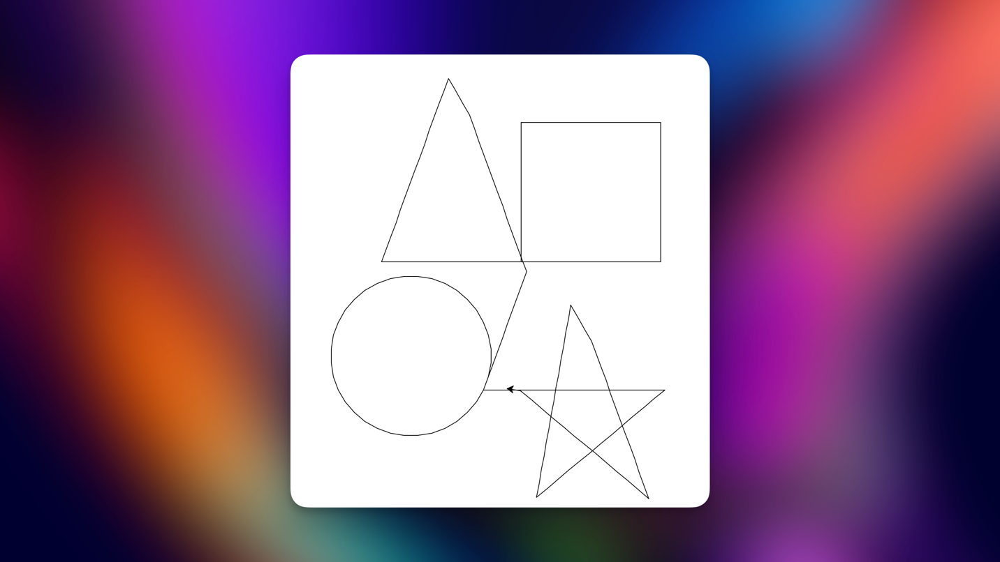
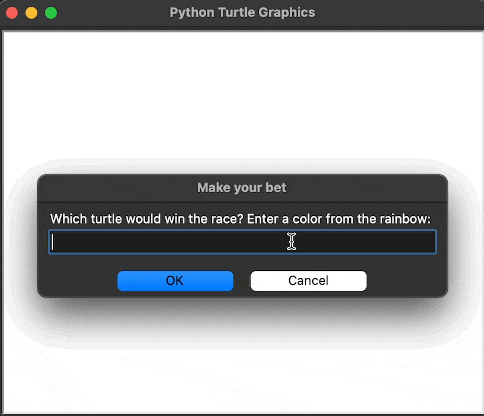

# Day 19 - Instances, State and Higher Order Functions
More Turtle Graphics, Event Listeners, State and Multiple Instances on an Object.

Goals:
- Make the Etch A Sketch toy
- A tutle racing game

## Concepts
Event listener: Liston and wait for user interaction like click or keypress to run some code whenever that action happens.


## Etch-A-Sketch Game

Requirements:
- W = Forwards
- S = Backwards
- A = Counter-Clockwise
- D = Clockwise
- C = Clear drawing

Pseudo-code:
1. Import and initialize the turtle module to use the Class Turtle and Screen
2. Make the functions for each key event
   1. move_forwards() with w by 20 steps
   2. move_backwards() with s by 20 steps
   3. turn_counter_clockwise() with a by 20 degrees
   4. turn_clockwise() with d by 20 degrees
3. Use the onkey(function, key) screen event for each function
4. Make the key "c" clear the screen
5. Make screen to start listening and wait for user actions
6. Make the program exit on click

```python
import turtle as t

tim = t.Turtle()
screen = t.Screen()


# Functions for each key event
def move_forwards():
    tim.forward(20)


def move_backwards():
    tim.backward(20)


def turn_clockwise():
    tim.right(10)


def turn_counter_clockwise():
    tim.left(10)


# On key events:
# For this method we use functions as an input. A function as input doesn't need the parenthesis.
screen.onkey(fun=move_forwards, key="w")
screen.onkey(fun=move_backwards, key="s")
screen.onkey(fun=turn_clockwise, key="d")
screen.onkey(fun=turn_counter_clockwise, key="a")


# Clear the screen
def clear_screen():
    tim.reset()


screen.onkey(fun=clear_screen, key="c")

# The screen waits for user actions.
screen.listen()

screen.exitonclick()
```


## Turtle racing

```python
import turtle as t
import random

screen = t.Screen()
screen.setup(width=500, height=400)
is_race_on = False
user_bet = screen.textinput(title="Make your bet", prompt="Which turtle would win the race? Enter a color from the "
                                                          "rainbow: ").lower()
colors_rainbow = ["red", "orange", "yellow", "green", "blue", "purple"]
all_turtles = []


# Create 6 turtles with different colors
y_cor = 90
for i in range(6):
    # Initialize with the shape of the turtle
    turtle = t.Turtle(shape="turtle")
    turtle.penup()
    turtle.color(colors_rainbow[i])
    turtle.goto(x=-230, y=y_cor)
    y_cor -= 30
    all_turtles.append(turtle)


if user_bet:
    is_race_on = True

while is_race_on:
    for turtle in all_turtles:
        if turtle.xcor() > 230:
            is_race_on = False
            winning_color = turtle.pencolor()
            if winning_color == user_bet:
                print(f"You've won! The {winning_color} turtle is the winner!")
            else:
                print(f"You've lost! The {winning_color} turtle is the winner!")
        rand_distance = random.randint(0, 10)
        turtle.forward(rand_distance)


screen.exitonclick()

```

