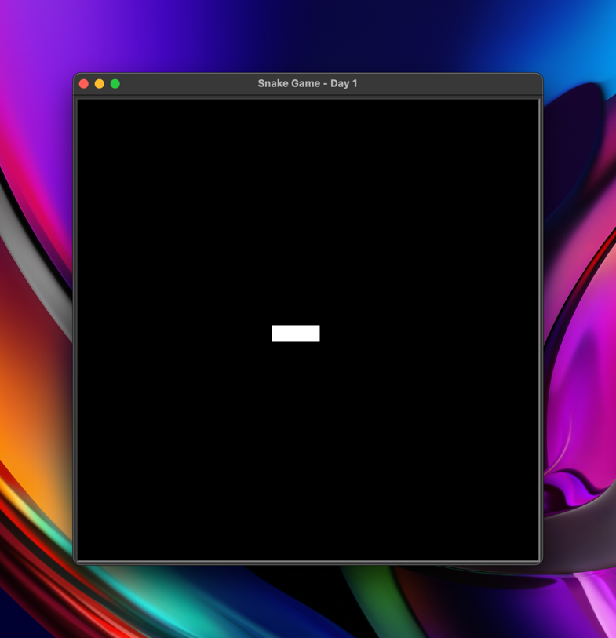

# Day 20 - Build the Snake Game Part 1: Animation & Coordinates

Goals:
- Build the first part of the Snake game
- End with 3 classes: Snake(), Food() and Scoreboard()

Breakdown the problem:<br>

1. Create a snake body (day 1)
2. Move the snake (day 1)
3. Create snake food (day 1)
4. Detect collision with food (day 2)
5. Create a scoreboard (day 2)
6. Detect collision with wall (day 2)
7. Detect collision with tail (day 2)

## Set up the screen

```python
from turtle import Turtle, Screen

screen = Screen()
screen.setup(width=600, height=600)
screen.bgcolor("black")
screen.title("Snake Game - Day 1")

screen.exitonclick()

```

## Create a Snake Body

The turtle has a dimension of 20x20.

```python
from turtle import Turtle, Screen

screen = Screen()
screen.setup(width=600, height=600)
screen.bgcolor("black")
screen.title("Snake Game - Day 1")

turtles = []
positions = [(0, 0), (-20, 0), (-40, 0)]

for i in range(3):
    turtle = Turtle(shape="square")
    turtle.color("white")
    turtle.goto(positions[i])
    turtles.append(turtle)


screen.exitonclick()

```



## Move the Snake
Make the Snake segments to move
```python
from turtle import Turtle, Screen
import time

screen = Screen()
screen.setup(width=600, height=600)
screen.bgcolor("black")
screen.title("Snake Game - Day 1")
screen.tracer(0)

segments = []
starting_positions = [(0, 0), (-20, 0), (-40, 0)]

for position in starting_positions:
    new_segment = Turtle(shape="square")
    new_segment.pu()
    new_segment.color("white")
    new_segment.goto(position)
    segments.append(new_segment)

game_is_on = True
while game_is_on:
    screen.update()
    time.sleep(0.1)
    for seg in segments:
        seg.forward(10)

screen.exitonclick()

```


### Make Snake be able to turn

```python
from turtle import Turtle, Screen
import time

screen = Screen()
screen.setup(width=600, height=600)
screen.bgcolor("black")
screen.title("Snake Game - Day 1")
screen.tracer(0)  # Turn off the auto update screen

# Snake
segments = []
starting_positions = [(0, 0), (-20, 0), (-40, 0)]

for position in starting_positions:
    new_segment = Turtle(shape="square")
    new_segment.pu()
    new_segment.color("white")
    new_segment.goto(position)
    segments.append(new_segment)


game_is_on = True
while game_is_on:
    screen.update()  # Update the screen
    time.sleep(0.1)  # Pause the script for 0.1 s

    # From the last segment to the start segment.
    for seg_index in range(len(segments) - 1, 0, -1):
        new_x = segments[seg_index - 1].xcor()
        new_y = segments[seg_index - 1].ycor()
        segments[seg_index].goto(new_x, new_y)  # Second to last segment.
    segments[0].forward(20)  # Depends on the dimensions of the turtle


screen.exitonclick()

```

### Create the Snake OOP

```python
from turtle import Turtle

segments = []
starting_positions = [(0, 0), (-20, 0), (-40, 0)]


class Snake:

    def __init__(self):
        self.create_snake()

    def create_snake(self):
        for position in starting_positions:
            new_segment = Turtle(shape="square")
            new_segment.pu()
            new_segment.color("white")
            new_segment.goto(position)
            segments.append(new_segment)

    def move(self):
        # From the last segment to the start segment.
        for seg_index in range(len(segments) - 1, 0, -1):
            new_x = segments[seg_index - 1].xcor()
            new_y = segments[seg_index - 1].ycor()
            segments[seg_index].goto(new_x, new_y)  # Second to last segment.
        segments[0].forward(20)  # Depends on the dimensions of the turtle

```

### Final Snake OOP
Snake Class:
```python
from turtle import Turtle

# segments = [] Will restart when we can the snake?
# Make it a constant, having constant to change the game in the future
STARTING_POSITIONS = [(0, 0), (-20, 0), (-40, 0)]
MOVE_DISTANCE = 20


class Snake:

    def __init__(self):
        self.segments = []
        self.create_snake()

    def create_snake(self):
        for position in STARTING_POSITIONS:
            new_segment = Turtle(shape="square")
            new_segment.pu()
            new_segment.color("white")
            new_segment.goto(position)
            self.segments.append(new_segment)

    def move(self):
        # From the last segment to the start segment.
        for seg_index in range(len(self.segments) - 1, 0, -1):
            new_x = self.segments[seg_index - 1].xcor()
            new_y = self.segments[seg_index - 1].ycor()
            self.segments[seg_index].goto(new_x, new_y)  # Second to last segment.
        self.segments[0].forward(MOVE_DISTANCE)  # Depends on the dimensions of the turtle

```
Main:
```python
from turtle import Turtle, Screen
import time
from snake import Snake

screen = Screen()
screen.setup(width=600, height=600)
screen.bgcolor("black")
screen.title("Snake Game - Day 1")
screen.tracer(0)  # Turn off the auto update screen

# Snake OBJECT
snake = Snake()


game_is_on = True
while game_is_on:
    screen.update()  # Update the screen
    time.sleep(0.1)  # Pause the script for 0.1 s

    snake.move()


screen.exitonclick()
```

## Control the Snake

Requirements:
- Create the methods up, down, left, and right. To change the heading

Snake:
```python
from turtle import Turtle

# segments = [] Will restart when we can the snake?
# Make it a constant, having constant to change the game in the future
STARTING_POSITIONS = [(0, 0), (-20, 0), (-40, 0)]
MOVE_DISTANCE = 20


class Snake:

    def __init__(self):
        self.segments = []
        self.create_snake()

    def create_snake(self):
        for position in STARTING_POSITIONS:
            new_segment = Turtle(shape="square")
            new_segment.pu()
            new_segment.color("white")
            new_segment.goto(position)
            self.segments.append(new_segment)

    def move(self):
        # From the last segment to the start segment.
        for seg_index in range(len(self.segments) - 1, 0, -1):
            new_x = self.segments[seg_index - 1].xcor()
            new_y = self.segments[seg_index - 1].ycor()
            self.segments[seg_index].goto(new_x, new_y)  # Second to last segment.
        self.segments[0].forward(MOVE_DISTANCE)  # Depends on the dimensions of the turtle

    def up(self):
        head = self.segments[0]
        head.seth(90)

    def down(self):
        head = self.segments[0]
        head.seth(270)

    def left(self):
        head = self.segments[0]
        head.seth(180)

    def right(self):
        head = self.segments[0]
        head.seth(0)

```
main
```python
from turtle import Turtle, Screen
import time
from snake import Snake

screen = Screen()
screen.setup(width=600, height=600)
screen.bgcolor("black")
screen.title("Snake Game - Day 1")
screen.tracer(0)  # Turn off the auto update screen

# Snake OBJECT
snake = Snake()

# Liston to user actions to move the Snake
screen.onkey(fun=snake.up, key="Up")
screen.onkey(fun=snake.down, key="Down")
screen.onkey(fun=snake.left, key="Left")
screen.onkey(fun=snake.right, key="Right")

screen.listen()

game_is_on = True
while game_is_on:
    screen.update()  # Update the screen
    time.sleep(0.1)  # Pause the script for 0.1 s

    snake.move()


screen.exitonclick()

```


## Final code
The snake can't be going up and then down. This applies to all the directions, similar to the game.

Main
```python
from turtle import Screen
import time
from snake import Snake

screen = Screen()
screen.setup(width=600, height=600)
screen.bgcolor("black")
screen.title("Snake Game - Day 1")
screen.tracer(0)  # Turn off the auto update screen

# Snake OBJECT
snake = Snake()

# Liston to user actions to move the Snake
screen.onkey(fun=snake.up, key="Up")
screen.onkey(fun=snake.down, key="Down")
screen.onkey(fun=snake.left, key="Left")
screen.onkey(fun=snake.right, key="Right")

screen.listen()

game_is_on = True
while game_is_on:
    screen.update()  # Update the screen
    time.sleep(0.1)  # Pause the script for 0.1 s

    snake.move()


screen.exitonclick()

```

Snake Class
```python
from turtle import Turtle

# segments = [] Will restart when we can the snake?
# Make it a constant, having constant to change the game in the future
STARTING_POSITIONS = [(0, 0), (-20, 0), (-40, 0)]
MOVE_DISTANCE = 20
UP = 90
DOWN = 270
LEFT = 180
RIGHT = 0


class Snake:

    def __init__(self):
        self.segments = []
        self.create_snake()
        self.head = self.segments[0]

    def create_snake(self):
        for position in STARTING_POSITIONS:
            new_segment = Turtle(shape="square")
            new_segment.pu()
            new_segment.color("white")
            new_segment.goto(position)
            self.segments.append(new_segment)

    def move(self):
        # From the last segment to the start segment.
        for seg_index in range(len(self.segments) - 1, 0, -1):
            new_x = self.segments[seg_index - 1].xcor()
            new_y = self.segments[seg_index - 1].ycor()
            self.segments[seg_index].goto(new_x, new_y)  # Second to last segment.
        self.segments[0].forward(MOVE_DISTANCE)  # Depends on the dimensions of the turtle

    def up(self):
        if self.head.heading() != DOWN:
            self.head.seth(90)

    def down(self):
        if self.head.heading() != UP:
            self.head.seth(270)

    def left(self):
        if self.head.heading() != RIGHT:
            self.head.seth(180)

    def right(self):
        if self.head.heading() != LEFT:
            self.head.seth(0)

```

