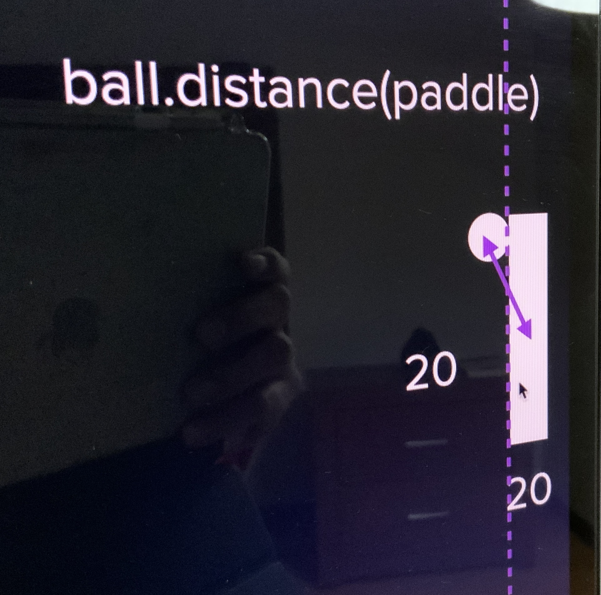

# Day 22 - Build Pong: The Famous Arcade Game

I will be using the turtle module

Breakdown of the project:
1. Create the screen
2. Create and move a paddle
3. Create another paddle
4. Create the ball and make it move
5. Detect collisions with wall and bounce
6. Detect collision with paddle
7. Detect when paddle misses
8. Keep score

## Create the screen

Created the screen with the turtle module.

Requirements:
- Change the background color to black
- The screen size is 800x600
- Should exit on click

```python
from turtle import Screen

screen = Screen()
screen.bgcolor("black")
screen.setup(width=800, height=600)
screen.title("Welcome to the Pong Game")

screen.exitonclick()
```

## Create and move a paddle + Create another paddle

Requirements:
- Create a paddle with the size 20x100
- The initial position is (350, 0)
- Should be able to move in the y-axis with the keys "Up" and "Down"

Main
```python
from turtle import Screen
from paddle import Paddle

screen = Screen()
screen.bgcolor("black")
screen.setup(width=800, height=600)
screen.title("Welcome to the Pong Game")
# Tracer method
screen.tracer(0)


# Create the paddle
r_paddle = Paddle((350, 0))
l_paddle = Paddle((-350, 0))


# Move the paddle
screen.listen()
screen.onkey(fun=r_paddle.move_up, key="Up")
screen.onkey(fun=r_paddle.move_down, key="Down")
screen.onkey(fun=l_paddle.move_up, key="w")
screen.onkey(fun=l_paddle.move_down, key="s")

# Game loop
is_game_on = True
while is_game_on:
    screen.update()


screen.exitonclick()

```

Paddle class
```python
from turtle import Turtle


class Paddle(Turtle):

    def __init__(self, position):
        super().__init__()
        self.shape("square")
        self.pu()
        self.speed(0)
        self.color("white")
        self.shapesize(stretch_wid=5, stretch_len=1)
        self.goto(position)

    def move_up(self):
        new_y = self.ycor() + 20
        self.sety(new_y)

    def move_down(self):
        new_y = self.ycor() - 20
        self.sety(new_y)


```

## Create the ball and make it move

Requirements:
- width = 20
- height = 20
- x_pos = 0
- y_pos = 0
- When the screen refreshes, move the ball to the upper right corner

Create a method in the ball class to move 1 pixel
```python
    def move_ball(self):
        new_x = self.xcor() + 1
        new_y = self.ycor() + 1
        self.goto(x=new_x, y=new_y)
```

In main, moved the method in the while loop.
```python
# Game loop
is_game_on = True
while is_game_on:
    screen.update()
    ball.move_ball()
```
Every time the screen refreshes the ball will move 1 pixel.


## Detect collision with wall and bounce

Requirement:
- Only in the top and bottom walls

Code in main, checked if the ball was at the limit top or bottom then called the new bounce method
```python
    # Wall collision and bounce
    if ball.ycor() > 280 or ball.ycor() < -280:
        ball.bounce()
    ball.move_ball()
```

Bounce method in the Ball class, modified the move ball increments to speed movement.
```python
class Ball(Turtle):

    def __init__(self):
        super().__init__()
        self.pu()
        self.shape("circle")
        self.color("white")
        self.y_speed_move = 1
        self.x_speed_move = 1

    def move_ball(self):
        new_x = self.xcor() + self.x_speed_move
        new_y = self.ycor() + self.y_speed_move
        self.goto(x=new_x, y=new_y)

    def bounce(self):
        self.y_speed_move *= -1
```

## Detect collision with paddle

With two requirements:
- Create a wall in the x axis for the next requirement.
- Check if the distance between the paddle ans ball in 50



I gave it a try before watching the solution and was similar to mine, changed the name of bounce and created bounce_x.
```python
    def bounce_y(self):
        self.y_speed_move *= -1

    def bounce_x(self):
        self.x_speed_move *= -1
```
In the main, the logic was correct similar to the solution but can be simplified

```python
    if ball.xcor() > 340 or ball.xcor() < -340:
        if ball.distance(l_paddle) < 50 or ball.distance(r_paddle) < 50:
            ball.bounce_x()
```

Simplified version and more readable

```python
    # Detect collision with a paddle
    if ball.xcor() > 330 and ball.distance(r_paddle) < 50 or ball.xcor() < -330 and ball.distance(l_paddle) < 50:
        ball.bounce_x()
```


## Detect when paddle misses

Checked if the ball have been almost out of the screen width that is 800, and if yes called a methos in ball to move the ball to the position (0, 0) and reverse the x direction of the ball.
The reason of why the condition is separated, is to use in the future for the score.
```python
    # Detect R paddle misses
    if ball.xcor() > 390:
        ball.reset_position()

    # Detect L paddle misses
    if ball.xcor() < -390:
        ball.reset_position()
```
Ball class
```python
    def reset_position(self):
        self.home()
        self.bounce_x()
```

## Create the scoreboard


