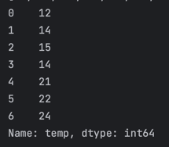
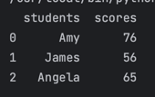

# Day 25 - Working with CSV Data and the Pandas Library

- Learn Pandas(Data analysis libraries)

## Work with CSV data

### Using csv library
Access a csv file and turn it into a list.
The problem is that feels like a faff
```python
import csv
with open("./weather_data.csv") as weather_data:  # Call data_file
    data = csv.reader(weather_data)
    temperatures = []
    for row in data:
        if row[1] != 'temp':
            temperatures.append(int(row[1]))

# Output: [12, 14, 15, 14, 21, 22, 24]
```
```csv
day,temp,condition
Monday,12,Sunny
Tuesday,14,Rain
Wednesday,15,Rain
Thursday,14,Cloudy
Friday,21,Sunny
Saturday,22,Sunny
Sunday,24,Sunny
```

## Usign Pandas

### Use pandas to extract information from a csv file

Using pandas
```python
import pandas

data = pandas.read_csv("./weather_data.csv")
temp_list = data["temp"].to_list()
# Output: [12, 14, 15, 14, 21, 22, 24]
```



### Get the average from the temp

```python
import pandas

# Extra work
# def average(dlist):
#     # a = sum/len
#     return sum(dlist)/len(dlist)
# Use the pandas library methods


data = pandas.read_csv("./weather_data.csv")
temp_list = data["temp"].to_list()
temp_series = data["temp"]
# Get the mean of temp
# print(average(temp_list))
print(data["temp"].mean())
# Get the maximum value of temp
print(temp_series.max())
print(data.temp.max())
```
- Can access columns like objects

### Get Data in rows

```python
data = pandas.read_csv("./weather_data.csv")
temp_list = data["temp"].to_list()
temp_series = data["temp"]

max_temp = temp_series.max()

print(data[data.day == "Monday"])
print(data[data.temp == max_temp])
print(data[data.temp == data.temp.max()])
```


### Get data from an specific row

```python
data = pandas.read_csv("./weather_data.csv")
monday = data[data.day == "Monday"]
print(monday)
celsius = monday.temp[0]  # Get the value out of the series
print(celsius)
fahrenheit = (celsius * 9 / 5) + 32
print(fahrenheit)
```

### Create a DataFrame form scratch

1. Create a pandas DataFrame class
2. Initialize it with the list or dictionary

```python
import pandas

data_dict = {
    "students": ["Amy", "James", "Angela"],
    "scores": [76, 56, 65]
}

data = pandas.DataFrame(data_dict)  # Create a pandas table
data.to_csv("Path to save") # Convert the DataFrame to a csv file
```



