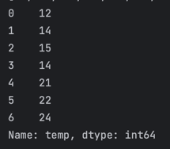
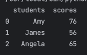
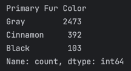
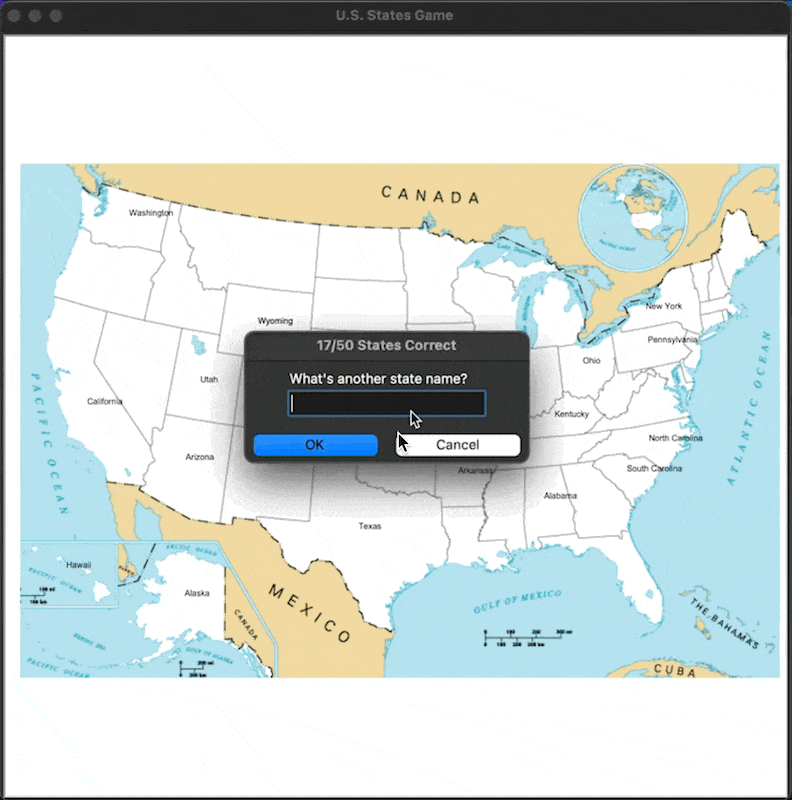
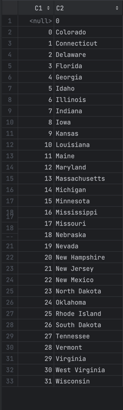

# Day 25 - Working with CSV Data and the Pandas Library

- Learn Pandas(Data analysis libraries)

## Work with CSV data

### Using csv library
Access a csv file and turn it into a list.
The problem is that feels like a faff

```python
import csv

with open("Pandas/weather_data.csv") as weather_data:  # Call data_file
    data = csv.reader(weather_data)
    temperatures = []
    for row in data:
        if row[1] != 'temp':
            temperatures.append(int(row[1]))

# Output: [12, 14, 15, 14, 21, 22, 24]
```
```csv
day,temp,condition
Monday,12,Sunny
Tuesday,14,Rain
Wednesday,15,Rain
Thursday,14,Cloudy
Friday,21,Sunny
Saturday,22,Sunny
Sunday,24,Sunny
```

## Usign Pandas

### Use pandas to extract information from a csv file

Using pandas

```python
import pandas

data = pandas.read_csv("Pandas/weather_data.csv")
temp_list = data["temp"].to_list()
# Output: [12, 14, 15, 14, 21, 22, 24]
```



### Get the average from the temp

```python
import pandas

# Extra work
# def average(dlist):
#     # a = sum/len
#     return sum(dlist)/len(dlist)
# Use the pandas library methods


data = pandas.read_csv("Pandas/weather_data.csv")
temp_list = data["temp"].to_list()
temp_series = data["temp"]
# Get the mean of temp
# print(average(temp_list))
print(data["temp"].mean())
# Get the maximum value of temp
print(temp_series.max())
print(data.temp.max())
```
- Can access columns like objects

### Get Data in rows

```python
data = pandas.read_csv("./weather_data.csv")
temp_list = data["temp"].to_list()
temp_series = data["temp"]

max_temp = temp_series.max()

print(data[data.day == "Monday"])
print(data[data.temp == max_temp])
print(data[data.temp == data.temp.max()])
```


### Get data from an specific row

```python
data = pandas.read_csv("./weather_data.csv")
monday = data[data.day == "Monday"]
print(monday)
celsius = monday.temp[0]  # Get the value out of the series
print(celsius)
fahrenheit = (celsius * 9 / 5) + 32
print(fahrenheit)

# Get the first item of the Series
# DataFrame.Series.item()
```

### Create a DataFrame form scratch

1. Create a pandas DataFrame class
2. Initialize it with the list or dictionary

```python
import pandas

data_dict = {
    "students": ["Amy", "James", "Angela"],
    "scores": [76, 56, 65]
}

data = pandas.DataFrame(data_dict)  # Create a pandas table
data.to_csv("Path to save") # Convert the DataFrame to a csv file
```


## Great Squirrel Census Data Analysis with Pandas

```python
squirrels_color = data["Primary Fur Color"].value_counts()
```

```python
squirrels_color.to_csv()
```
```csv
,Fur Color,Count
0,grey,2473
1,red,392
2,black,103
```

### My first try

```python
import pandas

# Create a DataFrame with the data
data = pandas.read_csv("Pandas/2018_Central_Park_Squirrel_Census_-_Squirrel_Data.csv")

# Take data: Fur color, Count
fur_color = data["Primary Fur Color"]
print(fur_color.tolist())

# Count how many colors of fur are
count = fur_color.value_counts()
black_fur = count["Black"]
cinnamon_fur = count["Cinnamon"]
gray_fur = count["Gray"]

# Build the new DataFrame
fur_color_dictionary = {
    "Fur Color": ["grey", "red", "black"],
    "Count": [gray_fur, cinnamon_fur, black_fur],
}

data_count = pandas.DataFrame(data=fur_color_dictionary)
data_count.to_csv("squirrel_count.csv")
```

### Another method

```python
# Create a DataFrame with the data
data = pandas.read_csv("2018_Central_Park_Squirrel_Census_-_Squirrel_Data.csv")

# Take data: Fur color, Count
fur_color = data["Primary Fur Color"]
print(fur_color.tolist())

# Count how many colors of fur are
black_fur = len(data[fur_color == "Black"])
cinnamon_fur = len(data[fur_color == "Cinnamon"])
gray_fur = len(data[fur_color == "Gray"])
```

## U.S. States Game

At the end if typed "Exit" will return a csv file with all the states missing.

Requirements:
1. Convert the guess to Title case
2. Check if the guess is among the 50 states
3. Write correct guesses onto the map
4. Use a loop to allow the user to keep guessing
5. Record the correct guesses in a list
6. Keep track of the score

First attempt:
```python
import turtle
import pandas
screen = turtle.Screen()
screen.title("U.S. States Game")
image = "blank_states_img.gif"
screen.addshape(image)

# Shape of the turtle to be the image
turtle.shape(image)
message = turtle.Turtle()
message.pu()
message.hideturtle()


# Check if the guess is among the 50 states
data = pandas.read_csv("./50_states.csv")

# Correct guesses
correct_states = []

score = 0

game_is_on = True
while game_is_on:

    # User State choice
    answer_state = screen.textinput(title=f"{score}/50 States Correct", prompt="What's another state name?")
    title_answer_state = answer_state.title()
    print(title_answer_state)

    if len(data[data.state == title_answer_state]) == 1:
        state = data.state[title_answer_state]
        y_cor = state.y
        x_cor = state.x
        coordinates = (x_cor.values[0], y_cor.values[0])
        message.goto(coordinates)
        message.write(title_answer_state)
        correct_states.append(title_answer_state)
        score += 1


print(coordinates)


# Keep the window open
screen.mainloop()
# screen.exitonclick()
```

Improved:
```python
import turtle
import pandas

screen = turtle.Screen()
screen.title("U.S. States Game")
image = "blank_states_img.gif"
screen.addshape(image)

# Shape of the turtle to be the image
turtle.shape(image)
# Message turtle
message = turtle.Turtle()
message.pu()
message.hideturtle()


# Check if the guess is among the 50 states
data = pandas.read_csv("50_states.csv")
all_states = data["state"].to_list()

# Correct guesses
guessed_states = []

while len(guessed_states) < 50:

    # User State choice
    answer_state = screen.textinput(title=f"{len(guessed_states)}/50 States Correct",
                                    prompt="What's another state name?").title()

    if answer_state == "Exit":
        # Save the missing states
        # states_to_learn.csv
        missing_states = []
        for state in all_states:
            if state not in guessed_states:
                missing_states.append(state)
        pandas.Series(missing_states).to_csv("states_to_learn.csv")
        break
    if answer_state in all_states:
        state = data[data.state == answer_state]  # Get the row of the state
        y_cor = state["y"].item()  # Get the value without dtype or name
        x_cor = state["x"].item()
        message.goto(x_cor, y_cor)  # Go to the location of the state
        message.write(answer_state)  # Write the name of the state
        guessed_states.append(answer_state)  # Add the state to the list

```



