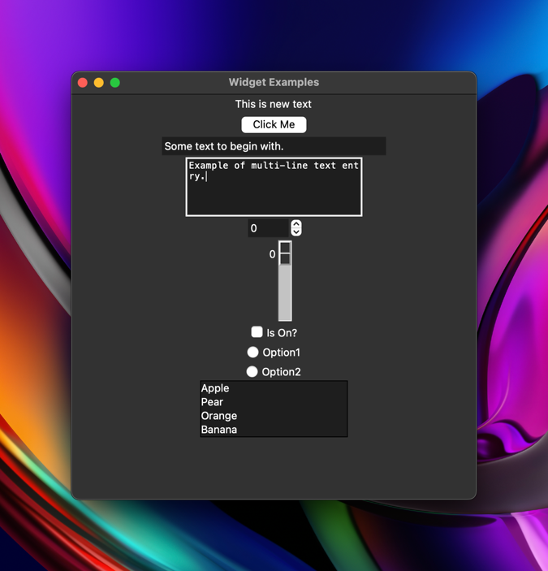

# Day 27: Tkinter and Arguments

Learn about:
- Tkinter library
- Default arguments
- *args
- **kwargs


## Tkinter
First lines of code
```python
import tkinter

screen = tkinter.Tk()
screen.title("My first Tkinter program")
screen.minsize(width=500, height=300)

label = tkinter.Label(text="Hello, Python!", font=("Arial", 25, "bold"))
label.pack()  # Necessary to make the label display

screen.mainloop()
```


## Advance Python Arguments

### Default Arguments
The values rarely change.
```python
def my_function(a=1, b=2, c=3):
    # Do this with a
    # Then this with b
    # Finally do this with c

# Modify a specific value
my_function(b=5)
```

### Arbitrary Positional Arguments (*args)
> Accept unlimited arguments that will be saved in a tuple, we identify them with the position.
- "Positional" means that these arguments are not associated with specific names or keywords; they are identified by their position in the argument list.
- "Arbitrary" means that you can pass any number of positional arguments to the function, and they will be collected into a tuple.
- This feature allows you to handle a variable number of input values without knowing in advance how many arguments will be passed.

Example:
```python
def add(*args):
    total = 0
    for num in args:
        total += num
    print(total)


add(1, 2, 3, 4, 5, 6, 7, 8, 9, 10, 0)

# Output: 55
```

### Arbitrary Keyword Arguments (**kwargs)
> Accept unlimited keywords arguments that will be saved in a dictionary, we identify them with the name.
- "Keyword" means that these arguments are associated with specific names or keywords.
- "Arbitrary" means that you can pass any number of keyword arguments to the function, and they will be collected into a dictionary.
- This feature allows you to handle a variable number of named arguments without knowing in advance which keywords will be used.

Example:
```python
def calculate(n, **kwargs):
    n += kwargs["add"]
    n *= kwargs["multiply"]
    print(n)


calculate(2, add=3, multiply=5)
# 25
```

Classes:
```python
class Car:
    def __init__(self, **kwargs):
        self.color = kwargs.get("color")
        #  The .get method returns the value of the keywords otherwise return None
        self.model = kwargs.get("model")
        self.make = kwargs.get("make")


my_car = Car(color="White", model="Q5", make="Audi")
```
The difference between dictionary index and .get() method:
- If the argument is not specified in the class constructor will return an error.
- The method .get return None when there is no values. Will not get and error.

## Tkinter Properties

### Change the properties of an Object
```python
# Label
my_label = tkinter.Label(text="I Am a Label", font=("Arial", 24, "bold"))  # At the creation
my_label["text"] = "New text"  # Dictionary Index
my_label.config(text="New text")  # Config method
```

## Widgets

Create a Label
```python
# Labels
label = Label(text="This is old text")
label.config(text="This is new text")
label.pack()
```

Create a Button
```python
# Buttons
def action():
    print("Do something")


# calls action() when pressed
button = Button(text="Click Me", command=action)
button.pack()
```


Create a Entry/Input
```python
# Entries
entry = Entry(width=30)
# Add some text to begin with
entry.insert(END, string="Some text to begin with.")
# Gets text in entry
print(entry.get())
entry.pack()
```

Create a Text
```python
# Text
text = Text(height=5, width=30)
# Puts cursor in textbox.
text.focus()
# Adds some text to begin with.
text.insert(END, "Example of multi-line text entry.")
# Gets current value in textbox at line 1, character 0
print(text.get("1.0", END))
text.pack()
```

Create a Spinbox
```python
# Spinbox
def spinbox_used():
    # gets the current value in spinbox.
    print(spinbox.get())


spinbox = Spinbox(from_=0, to=10, width=5, command=spinbox_used)
spinbox.pack()
```

Create a Scale
```python
# Scale
# Called with current scale value.
def scale_used(value):
    print(value)


scale = Scale(from_=0, to=100, command=scale_used)
scale.pack()
```

Create a Checkbutton
```python
# Checkbutton
def checkbutton_used():
    # Prints 1 if On button checked, otherwise 0.
    print(checked_state.get())


# variable to hold on to checked state, 0 is off, 1 is on.
checked_state = IntVar()
checkbutton = Checkbutton(text="Is On?", variable=checked_state, command=checkbutton_used)
checked_state.get()
checkbutton.pack()
```

Create a Radiobutton
```python
# Radiobutton
def radio_used():
    print(radio_state.get())


# Variable to hold on to which radio button value is checked.
radio_state = IntVar()
radiobutton1 = Radiobutton(text="Option1", value=1, variable=radio_state, command=radio_used)
radiobutton2 = Radiobutton(text="Option2", value=2, variable=radio_state, command=radio_used)
radiobutton1.pack()
radiobutton2.pack()
```

Create a Listbox
```python
# Listbox
def listbox_used(event):
    # Gets current selection from listbox
    print(listbox.get(listbox.curselection()))


listbox = Listbox(height=4)
fruits = ["Apple", "Pear", "Orange", "Banana"]
for item in fruits:
    listbox.insert(fruits.index(item), item)
listbox.bind("<<ListboxSelect>>", listbox_used)
listbox.pack()
window.mainloop()
```



# Miles to Kilometer Converter

```python
from tkinter import *

# FONT = ("Arial", 24, "normal")

screen = Tk()
screen.title("Mile to Kilometer Converter")
screen.config(padx=20, pady=20)
# screen.minsize(width=500, height=300)

# Labels
label = Label(text="Miles")  # miles_label
label.grid(column=2, row=0)

label2 = Label(text="Kilometers")  # kilometer_label
label2.grid(column=2, row=1)

label3 = Label(text="is equal to")  # is_equal_label
label3.grid(column=0, row=1)

result = Label(text="0")  # kilometer_result_label
result.grid(column=1, row=1)

# Entry
entry = Entry(width=10)  # miles_input/entry
entry.insert(END, string="0")
entry.grid(column=1, row=0)


def button_action():  # miles_to_km
    miles = float(entry.get()) * 1.609
    result.config(text=round(miles, 4))


# Create a button
button = Button(text="Calculate", command=button_action)  # calculate_button
button.grid(column=1, row=2)


screen.mainloop()
```

